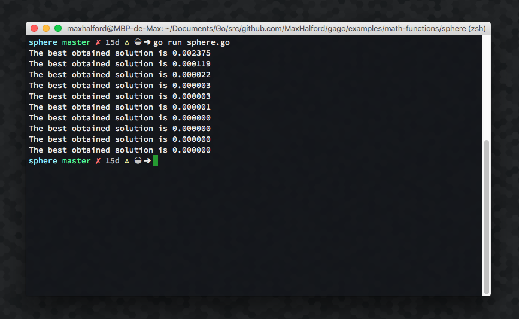

<div align="center">
  <!-- Logo -->
   
</div>

<div align="center">
  <!-- Go awesome -->
  <a href="https://github.com/sindresorhus/awesome">
    
  </a>
</div>

<br/>

<div align="center">
  <!-- License -->
  <a href="https://opensource.org/licenses/MIT">
    
  </a>
  <!-- CodeWake -->
  <a href="https://www.codewake.com/p/gago">
    
  </a>
  <!-- godoc -->
  <a href="https://godoc.org/github.com/MaxHalford/gago">
    
  </a>
  <!-- readthedocs -->
  <a href="http://gago.readthedocs.io/">
    
  </a>
  <!-- Build status -->
  <a href="https://img.shields.io/travis/MaxHalford/gago">
    
  </a>
  <!-- Test coverage -->
  <a href="https://coveralls.io/github/MaxHalford/gago?branch=master">
    
  </a>
  <!-- Go report card -->
  <a href="https://goreportcard.com/report/github.com/MaxHalford/gago">
    
  </a>
  <!-- Dependencies -->
  <a href="https://godoc.org/github.com/MaxHalford/gago?imports">
    
  </a>
</div>

<br/>

<div align="center"><code>gago</code> is a <b>framework</b> written in <b>Go</b> for running <b>genetic algorithms</b></div>

<br/>

<div align="center">For an introduction, example usage, contributing guidelines, please refer to the <a href="http://gago.readthedocs.io/"><b>documentation</b></a>.</div>

## Quick start

It's relatively easy to start using gago by using a [preset](http://gago.readthedocs.io/en/latest/usage/#presets).

```go
package main

import (
    "fmt"
    m "math"

    "github.com/MaxHalford/gago/presets"
)

// Sphere function minimum is 0 reached in (0, ..., 0).
// Any search domain is fine.
func sphere(X []float64) float64 {
    sum := 0.0
    for _, x := range X {
        sum += m.Pow(x, 2)
    }
    return sum
}

func main() {
    // Instantiate a GA with 2 variables and the fitness function
    var ga = presets.Float64(2, sphere)
    ga.Initialize()
    // Enhancement
    for i := 0; i < 10; i++ {
        ga.Enhance()
        // Display the current best solution
        fmt.Printf("The best obtained solution is %f\n", ga.Best.Fitness)
    }
}
```

<br/>

<div align="center">
  
</div>

<br/>

A preset is simply a genetic algorithm configuration. It's unlikely that a preset will find an optimal solution as is. Presets should be considered as starting points and should be tuned for specific problems. The following is the preset that was used for the previous example.

```go
// Float returns a configuration for minimizing continuous mathematical
// functions with a given number of variables.
func Float(n int, function func([]float64) float64) gago.GA {
    return gago.GA{
        NbrPopulations: 2,
        NbrIndividuals: 30,
        NbrGenes:       n,
        Ff: gago.Float64Function{
            Image: function,
        },
        Initializer: gago.InitUniformF{
            Lower: -1,
            Upper: 1,
        },
        Model: gago.ModGenerational{
            Selector: gago.SelTournament{
                NbParticipants: 3,
            },
            Crossover: gago.CrossUniformF{},
            Mutator: gago.MutNormalF{
                Rate: 0.5,
                Std:  3,
            },
            MutRate: 0.5,
        },
        Migrator:     gago.MigShuffle{},
        MigFrequency: 10,
    }
}
```

## Why use gago?

- It's architectured in a modular way.
- It allows using different evolutionary models.
- It's ambitious in the sense that it wants to implement every kind of operator possible.
- It allows implementing custom genetic operators.
- It makes it possible to use speciation.
- It makes it possible to run multiple populations in parallel (and to add migration).
- It's open to suggestions and to improvements.
- It's heavily commented.
- It has no external dependencies.
- It's got a high test coverage.
- It's actively maintained and will remain one my priorities for a very long time.

## Alternatives

- [GeneticGo](https://github.com/handcraftsman/GeneticGo)
- [goga](https://github.com/tomcraven/goga)
- [go-galib](https://github.com/thoj/go-galib)

## Contact

Feel free to contact me at **maxhalford25@gmail.com** for any enquiries.

You can also ask questions on [codewake](https://www.codewake.com/p/gago).
