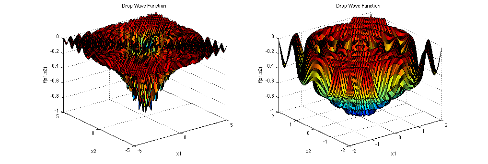
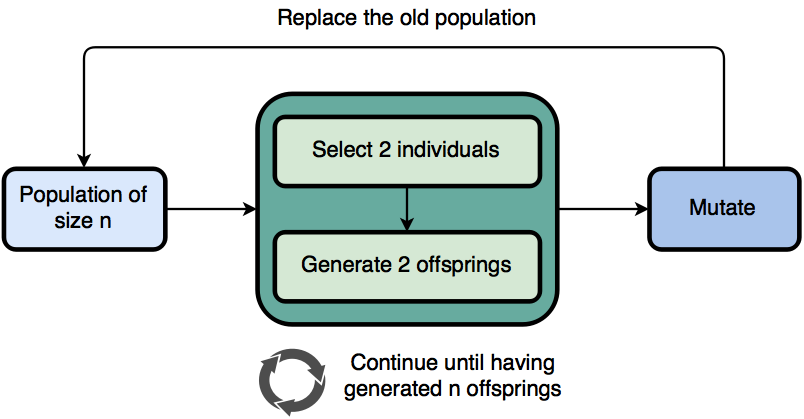
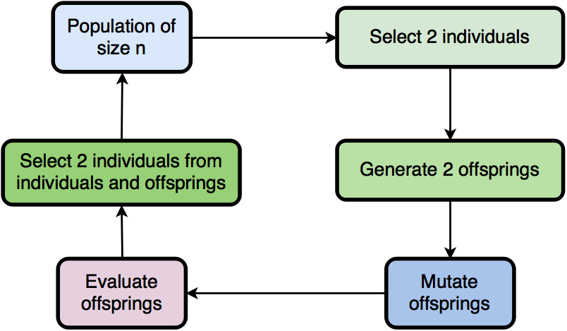
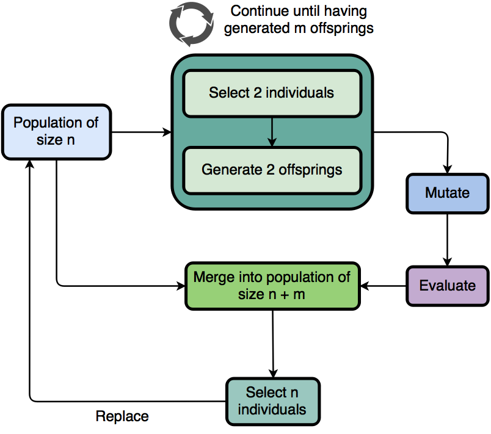
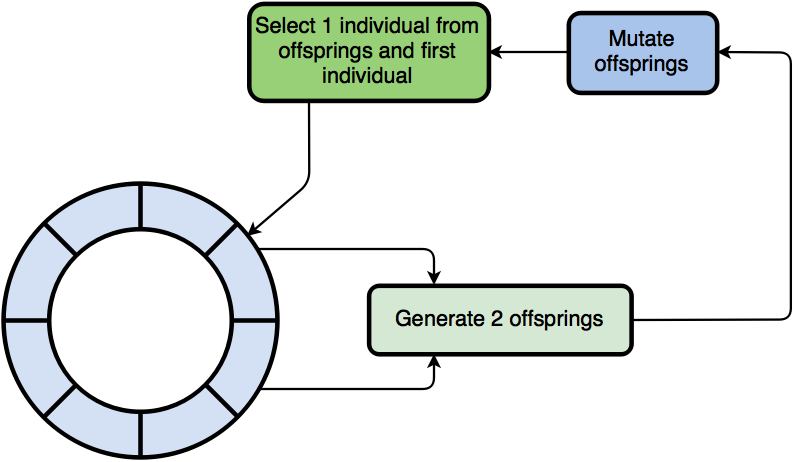
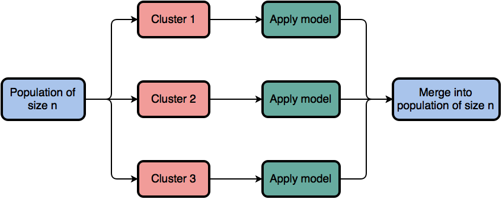

<div align="center">
  <!-- Logo -->
  
</div>

<div align="center">
  <!-- Go awesome -->
  <a href="https://github.com/sindresorhus/awesome">
    
  </a>
</div>

<br/>

<div align="center">
  <!-- godoc -->
  <a href="https://godoc.org/github.com/MaxHalford/gago">
    
  </a>
  <!-- Build status -->
  <a href="https://img.shields.io/travis/MaxHalford/gago">
    
  </a>
  <!-- Test coverage -->
  <a href="https://coveralls.io/github/MaxHalford/gago?branch=master">
    
  </a>
  <!-- Go report card -->
  <a href="https://goreportcard.com/report/github.com/MaxHalford/gago">
    
  </a>
  <!-- Dependencies -->
  <a href="https://godoc.org/github.com/MaxHalford/gago?imports">
    
  </a>
</div>

<br/>

<div align="center">gago is an extensive toolkit for implementing genetic algorithms</div>

<br/>

## Example

The following example attempts to minimize the [Drop-Wave function](https://www.sfu.ca/~ssurjano/drop.html).



```go
package main

import (
    "fmt"
    m "math"
    "math/rand"

    "github.com/MaxHalford/gago"
)

// A Vector contains float64s.
type Vector []float64

// Evaluate a Vector with the Drop-Wave function which takes two variables as
// input and reaches a minimum of -1 in (0, 0).
func (X Vector) Evaluate() float64 {
    var (
        numerator   = 1 + m.Cos(12*m.Sqrt(m.Pow(X[0], 2)+m.Pow(X[1], 2)))
        denominator = 0.5*(m.Pow(X[0], 2)+m.Pow(X[1], 2)) + 2
    )
    return -numerator / denominator
}

// Mutate a Vector by applying by resampling each element from a normal
// distribution with probability 0.8.
func (X Vector) Mutate(rng *rand.Rand) {
    gago.MutNormal(X, rng, 0.8)
}

// Crossover a Vector with another Vector by applying 1-point crossover.
func (X Vector) Crossover(Y gago.Genome, rng *rand.Rand) (gago.Genome, gago.Genome) {
    var o1, o2 = gago.CrossNPointFloat64(X, Y.(Vector), 1, rng) // Returns two float64 slices
    return Vector(o1), Vector(o2)
}

// MakeVector returns a random vector by generating 5 values uniformally
// distributed between -10 and 10.
func MakeVector(rng *rand.Rand) gago.Genome {
    return Vector(gago.InitUnifFloat64(4, -10, 10, rng))
}

func main() {
    var ga = gago.Generational(MakeVector)
    fmt.Printf("Best fitness at generation 0: %f\n", ga.Best.Fitness)
    for i := 1; i < 10; i++ {
        ga.Enhance()
        fmt.Printf("Best fitness at generation %d: %f\n", i, ga.Best.Fitness)
    }
}

```

```sh
>>> Best fitness at generation 0: -0.119248
>>> Best fitness at generation 1: -0.286210
>>> Best fitness at generation 2: -0.286210
>>> Best fitness at generation 3: -0.513424
>>> Best fitness at generation 4: -0.513424
>>> Best fitness at generation 5: -0.821705
>>> Best fitness at generation 6: -0.980396
>>> Best fitness at generation 7: -0.999257
>>> Best fitness at generation 8: -0.999257
>>> Best fitness at generation 9: -0.999257
```

**More examples**

- [String matching](examples/string_matching.go)
- [Solving the TSP on a grid](examples/tsp_grid.go)

## Background

There is a lot of intellectual fog around the concept of genetic algorithms (GAs). It's important to appreciate the GAs are composed of many nuts and bolts. **There isn't a single genetic algorithm**. `gago` is intented to be a framework where one can run many kinds of genetic algorithms, with different evolution models and genetic operators.

### Terminology

- ***Fitness function***: The fitness function is simply the function associated to a given problem. It takes in an input and returns an output.
- ***Individual***: An individual contains a **genome** which represents a candidate solution. In the physical world, an individual's genome is composed of acids. In an imaginary world, it could be composed of floating point numbers or string sequences representing cities. A **fitness** can be associated to a genome thanks to the fitness function. For example, one could measure the height of a group of individuals in order to rank them. In this case the genome is the body of the individual, the fitness function is the act of measuring the height of the individual's body and the fitness is the height of individual measured by the fitness function.
- ***Population***: Individuals are contained in a population wherein they can interact.
- ***Crossover***:  A crossover acts on two or more individuals (called **parents**) and mixes their genome in order to produce one or more new individuals (called **offsprings**). Crossover is really what sets genetic algorithms apart from other evolutionary methods.
- ***Selection***: Selection is a process in which parents are selected to generate offsprings, most often by applying a crossover method. Popular selection methods include **elitism selection** and **tournament selection**.
- ***Mutation***: Mutation applies random modifications to an individual's genome without interacting with other individuals.
- ***Migration***: **Multi-population** GAs run more than one population in parallel and exchange individuals between each other.
- ***Speciation***: In the physical world, individuals do not mate at random. Instead, they mate with similar individuals. For some problems such as neural network topology optimization, crossover will often generate poor solutions. Speciation sidesteps this by mating similar individuals (called **species**) separately.
- ***Evolution model***: An evolution model describes the exact manner and order in which genetic operators are applied to a population. The most popular models are the **steady state model** and the **generational model**.

### Methodology

In a nutshell, a GA solves an optimization problem by doing the following:

1. Generate random solutions.
2. Evaluate the solutions.
3. Sort the solutions according to their evaluation score.
4. Apply genetic operators following a model.
5. Repeat from step 2 until the stopping criterion is not satisfied.


This description is voluntarily vague as to how the genetic operators are applied. It's important to understand that there isn't a single way of applying genetic algorithms. For example some people believe that crossover is useless and use mutation for generating new individuals. Genetic operators are applied following a **model**, a fact that is often omitted in introductions to genetic algorithms. Popular stopping criterions include

- a fixed number of generations,
- a fixed duration,
- an indicator that the population is stagnating.


## Features

- Use different kinds of evolution strategies/models.
- Out-of-the-box genetic operators are available.
- Advanced operators (speciation, migration, parallel populations) are implemented.
- Implement your own genetic operators if necessary.
- Genomes do not necessarily have to be slices/arrays.


## Usage

TO REDO

`gago` makes it easy to work with complex genetic algorithms (GAs). Indeed GAs can be complex if one wants to use exotic operators such as migration or speciation, or even both at the same time. To use `gago`, one has to build a `GA` object that suits a particular problem. The `GA` is built by defining the following list of attributes. For the sake of example we can illustrate each attribute by applying a `GA` to the [travelling salesman problem (TSP)](https://www.wikiwand.com/en/Travelling_salesman_problem).

1. `Ff`: Define the fitness that has to be optimized. One issue that arises is the type of the entry parameters. To avoid having the user to mess with `gago` internal types, a transition function has to be used to convert a slice of interfaces `[]interface` to the type used by the fitness function; whatever the problem the output has to a `float64`. Some transition functions [already exist](fitness.go). For the TSP the fitness function would take as input a list of strings and would calculate the total distance between each point by matching point to a point in space with a lookup table.
2. `Initializer`: Define a function that can generate new individuals. This function will populate the initial population(s) when the GA is initialized. Again, some good-to-go initializers [already exist](initializing.go). For the TSP the `Initializer` would generate a list of strings in a random order.
3. `Topology`: Choose how many populations|clusters|individuals|genes will be used. The number of clusters is optional because it means that speciation will be used. All the other numbers are required. The number of genes is usually determined from the problem. For the TSP the number of genes would be the number of points the travelling salesman has to go through.
4. `Model`: Choose how the individuals will evolve. This is where `gago` shines because different evolution models can be tried out without having to modify the previous parameters. Moreover, not many packages allow the use of different evolution models.

- If you want to use migration, simply specify the `Migrator` and the `MigFrequency` attributes. The `Migrator` will shuffle the populations every `MigFrequency` generations.
- Feel free to check out the [examples folder](examples/) and the [presets](presets/) folder to get a better idea of how `gago` works!
- Please refer to [godoc](https://godoc.org/github.com/MaxHalford/gago) for specific information about the available genetic operators (mutation, crossover, selection, speciation, migration).

### Models

`gago` is generic enough so as to make it possible to easy use different so called *models*. Simply put, a models tells the story of how a GA enhances a population of individuals through a sequence of genetic operators. It does so without considering whatsoever the underlying operators. In a nutshell, an evolution model attemps to mimic evolution in the real world. **It's extremely important to choose a good model because it is usually the highest influence on the performance of a GA**.

#### Generational model

The generational model is one the, if not the most, popular models. Simply put it generates *n* offsprings from a population of size *n* and replaces the population with the offsprings. The offsprings are generated by selecting 2 individuals from the population and applying a crossover method to the selected individuals until the *n* offsprings have been generated. The newly generated offsprings are then optionally mutated before replacing the original population. Crossover generates two new individuals, thus if the population size isn't an even number then the second individual from the last crossover (individual *n+1*) won't be included in the new population.

##### Diagram



##### Pseudocode

```
offsprings = ()
while size of offspring < size of population:
    parent1, parent2 = select(population, 2)
    offspring1, offspring2 = crossover(parent1, parent2)
    add offspring1 and offspring2 to offsprings

for each individual of offsprings:
    if rand() < mutationRate:
        mutate(individual)

replace population with offsprings
```

##### Parameters

| Parameter       | Presence |
|-----------------|----------|
| Selector        | Required |
| Crossover       | Required |
| Mutator         | Optional |
| Mutation rate   | Optional |

---

#### Steady state model

The steady state model differs from the generational model in that the entire population isn't replaced between each generations. Instead of adding the children of the selected parents into the next generation, the 2 best individuals out of the two parents and two children are added back into the population so that the population size remains constant. However, one may also replace the parents with the children regardless of their fitness. This method has the advantage of not having to evaluate the newly generated offsprings. Whatsmore, crossover often generates individuals who are sub-par but who have a lot of potential; giving individuals generated from crossover a chance can be beneficial on the long run.

##### Diagram



##### Pseudocode

```
parent1, parent2 = select(population, 2)
offspring1, offspring2 = crossover(parents)

for each offspring:
    if rand() < mutationRate:
        mutate(offspring)

if keepBest:
    evaluate(offspring1)
    evaluate(offspring2)
    best1, best2 = selectBest(parent1, parent2, offspring1, offspring2)
    replace parent1 with best1
    replace parent1 with best2
else:
    replace parent1 with offspring1
    replace parent1 with offspring2
```

##### Parameters

| Parameter       | Presence |
|-----------------|----------|
| Selector        | Required |
| Crossover       | Required |
| KeepBest        | Required |
| Mutator         | Optional |
| Mutation rate   | Optional |

---

#### Select down to size

The select down to size method uses two selection rounds. The first one is classic and picks parents to generate new individuals with crossover. However, the offsprings are then added to the original population and a second selection round occurs to determine which individuals will survive to the next generation. Formally *m* offsprings are generated from a population of *n*, the *n+m* individuals are then "selected down to size" so that there only remains *n* individuals. Finally the *n* newly selected individuals may be mutated.

##### Diagram



##### Pseudocode

```
offsprings = generateOffsprings(m, individuals, selectorA, crossover)

for each offspring:
    if rand() < mutationRate:
        mutate(offspring)
    evaluate(offspring)

offsprings = merge(offsprings, individuals)

individuals = select(len(individuals), offsprings, selectorB)
```

##### Parameters

| Parameter       | Presence |
|-----------------|----------|
| NbrOffsprings   | Required |
| SelectorA       | Required |
| Crossover       | Required |
| SelectorB       | Required |
| Mutator         | Optional |
| Mutation rate   | Optional |

---

#### Ring model

In the ring model, each individual crosses over with its neighbor in a one-directional ring topology. One of the individuals out of offsprings or the original individual is selected to replace the original individual. Formally, an individual at position *i* will crossover with it's neighbour at position *i+1* and generates 2 offsprings. The last individual is connected to the first individual.

##### Diagram



##### Pseudocode

```
foreach i, individual in individuals:
    neighbour = individuals[i % len(individuals)]
    offspring1, offspring2 = crossover(individual, neighbour)
    selected = select(individual, offspring1, offspring2)
    individuals[i] = selected

for each individual of individuals:
    if rand() < mutationRate:
        mutate(individual)
```

##### Parameters

| Parameter       | Presence |
|-----------------|----------|
| Selector        | Required |
| Crossover       | Required |
| Mutator         | Optional |
| Mutation rate   | Optional |

---

#### Simulated annealing

Although [simulated annealing](https://www.wikiwand.com/en/Simulated_annealing) isn't a genetic algorithm, it can nonetheless be implemented with gago. A mutator is the only necessary operator. Other than that a starting temperature, a stopping temperature and a decrease rate have to be provided. Effectively a single simulated annealing is run for each individual in the population.

!!! note "Note"
    The temperature evolution is relative to one single generation. In order to mimic the original simulated annealing algorithm, one would the number of individuals to 1 and would run the algorithm for only 1 generation. However, nothing stops you from running many simulated annealings and to repeat them over many generations.

##### Pseudocode

```
while T > T_min:
    foreach i, individual in individuals:
        neighbour = mutate(individual)
        if neighbour.fitness < individual.fitness:
            individuals[i] = neighbour
        else:
            ap = exp((neighbour.fitness - individual.fitness) / T)
            if rand() < ap:
                individuals[i] = neighbour
    T = T * alpha
```

##### Parameters

| Parameter                     | Presence |
|-------------------------------|----------|
| Mutator                       | Required |
| Starting temperature (T)      | Required |
| Stopping temperature (Tmin)   | Required |
| Decrease rate (Alpha)         | Required |

---

#### Mutation only

Although [simulated annealing](https://www.wikiwand.com/en/Simulated_annealing) isn't a genetic algorithm, it can nonetheless be implemented with gago. A mutator is the only necessary operator. Other than that a starting temperature, a stopping temperature and a decrease rate have to be provided. Effectively a single simulated annealing is run for each individual in the population.

##### Pseudocode

```
parents = select(nbr_parents, individuals)
offsprings = []
i = 0

foreach parent of parents:
    if keep_parents:
        offsprings[i] = parent
        i++
    for j in 0 to nbr_offsprings:
        offsprings[j] = mutate(parent)
        i++

individuals = offsprings
```

##### Parameters

| Parameter                     | Presence |
|-------------------------------|----------|
| NbrParents                    | Required |
| Selector                      | Required |
| KeepParents                   | Required |
| NbrOffsprings                 | Required |
| Mutator                       | Required |


### Multiple populations and migration


### Clustering

Clusters, also called speciation in the litterature, are a partitioning of individuals into smaller groups of similar individuals. Programmatically a cluster is a list of lists each containing individuals. Individuals inside each clusters are supposed to be similar. The similarity depends on a metric, for example it could be based on the fitness of the individuals. In the litterature, clustering is also called *speciation*.

The purpose of a partinioning individuals is to apply genetic operators to similar individuals. In biological terms this encourages "incest" and maintains isolated species. For example in nature animals usually breed with local mates and don't breed with different animal species.

Using clustering/speciation with genetic algorithms became "popular" when they were first applied to the [optimization of neural network topologies](https://www.wikiwand.com/en/Neuroevolution_of_augmenting_topologies). By mixing two neural networks during crossover, the resulting neural networks were often useless because the inherited weights were not optimized for the new topology. This meant that newly generated neural networks were not performing well and would likely dissapear during selection. Thus speciation was introduced so that neural networks evolved in similar groups so that new neural networks wouldn't dissapear immediatly. Instead the similar neural networks would evolve between each other until they were good enough to mixed with the other neural networks.

With gago it's possible to use clustering on top of all the rest. For the time, the only kind of clustering is fitness based. Later on it will be possible to provided a function to compare two individuals based on their genome. What happens is that a population of `n` individuals is grouped into `k` clusters before applying an evolution model to each cluster. The `k` clusters are then merged into a new population of `n` individuals. This way, clusters don't interact with other clusters.




### Presets


## FAQ

**What if I don't want to use crossover?**

Alas you still have to implement the `Genome` interface. You can however provide a blank `Crossover` method which will only serve to implement the interface.

```go
type Vector []float64

func (X Vector) Crossover(Y interface{}, rng *rand.Rand) (gago.Genome, gago.Genome) {
    return X, Y.(Vector)
}
```

**Why isn't my `Mutate` method modifying my `Genome`?**

The `Mutate` has to modify the values of the `Genome` inplace. The following code will work because the `Vector` is a slice; slices in Golang are references to underlying data, hence modifying a slice modifies them inplace.

```go
type Vector []float64

func (X Vector) Mutate(rng *rand.Rand) {
    gago.MutNormal(X, rng, 0.5)
}
```

On the contrary, mutating other kind of structs will require the `*` symbol to access the struct's pointer. Notice the `*Name` in the following example.

```go
type Name string

func (n *Name) Mutate(rng *rand.Rand) {
    n = randomName()
}
```

**When are genetic algorithms good to apply?**

Genetic algorithms (GAs) are often used for [NP-hard problems](https://www.wikiwand.com/en/NP-hardness). They *usually* perform better than [hill climbing](https://www.wikiwand.com/en/Hill_climbing) and [simulated annealing](https://www.wikiwand.com/en/Simulated_annealing) because they explore the search space more intelligently. However, GAs can also be used for classical problems where the search space makes it difficult for, say, gradient algorithms to be efficient (like the introductory example).

As mentionned earlier, some problems can simply not be written down as [closed-form expressions](https://www.wikiwand.com/en/Closed-form_expression). For example tuning the number of layers and of neurons per layer in a neural network is an open problem that doesn't yet have a reliable solution. Neural networks used in production are usually architectured by human experts. The field of [neuroevolution](https://www.wikiwand.com/en/Neuroevolution) aims to train neural networks with evolutionary algorithms. As such genetic algorithms are a good candidate for training neural networks, usually by optimizing the network's topology.

**How can I contribute?**

Feel free to implement your own operators or to make suggestions! Check out the [CONTRIBUTING.md](CONTRIBUTING.md) file for some guidelines.


## Alternatives

- [GeneticGo](https://github.com/handcraftsman/GeneticGo)
- [goga](https://github.com/tomcraven/goga)
- [go-galib](https://github.com/thoj/go-galib)


## License

<a href="https://opensource.org/licenses/MIT">

</a>
