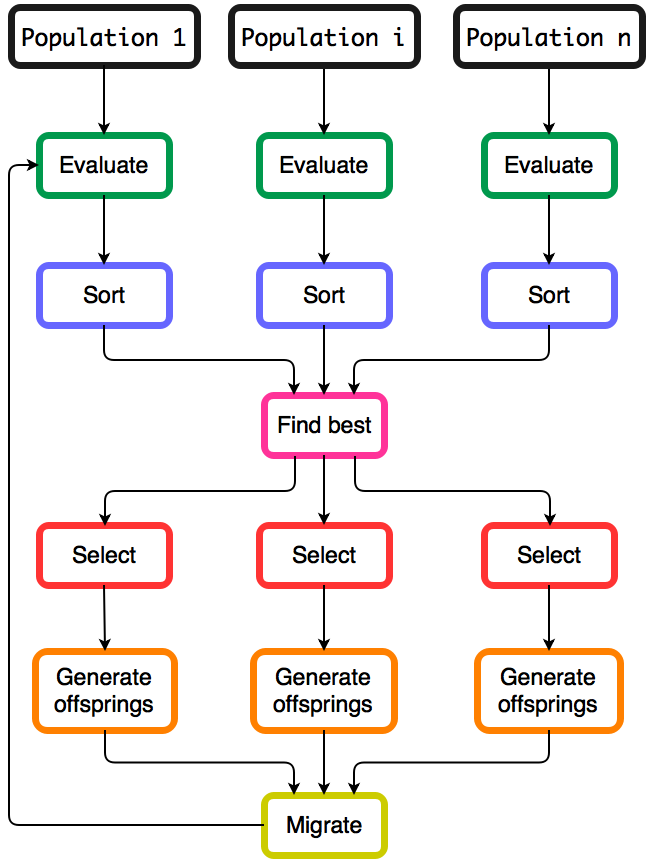

[](https://godoc.org/github.com/MaxHalford/gago)

[](https://coveralls.io/github/MaxHalford/gago?branch=master)
[](https://goreportcard.com/report/github.com/MaxHalford/gago)
[](https://godoc.org/github.com/MaxHalford/gago?imports)

[](https://github.com/sindresorhus/awesome)

`gago` is a framework for running genetic algorithms. It is written in Go.

In its most basic form, a [genetic algorithm](https://www.wikiwand.com/en/Genetic_algorithm) solves a mathematically posed problem by doing the following:

1. Generate random solutions.
2. Evaluate the solutions.
3. Sort the solutions according to their evaluation score.
4. Select parents for breeding.
5. Apply [crossover](http://www.wikiwand.com/en/Crossover_(genetic_algorithm)) to generate new solutions.
6. [Mutate](https://www.wikiwand.com/en/Mutation_(genetic_algorithm)) the newly generated solutions.
7. Repeat from step 2 until satisfied.

Genetic algorithms can be applied to many problems, the only variable being the problem itself. Indeed, the underlying structure does not have to change between problems. With this in mind, `gago` has been built to be reusable. What's more, `gago` is a [multi-GA genetic algorithm](http://www.pohlheim.com/Papers/mpga_gal95/gal2_1.html) implementing the *migration model*, in that sense it can perform better than a traditional genetic algorithm for certain scenarios.

Genetic algorithms are notorious for being [embarrassingly parallel](http://www.wikiwand.com/en/Embarrassingly_parallel). Indeed, most calculations can be run in parallel because they only affect one individual. Luckily Go provides good support for parallelism. As some gophers may know, the `math/rand` module can be problematic because there is a global lock the random number generator, the problem is described in this [stackoverflow post](http://stackoverflow.com/questions/14298523/why-does-adding-concurrency-slow-down-this-golang-code). This can be circumvented by providing each GA with it's own generator.

The following flowchart shows the steps the algorithms takes. As can be seen only the search for the best individual and the migration can't be parallelized.



## Terminology

The terms surrounding genetic algorithms (GAs) are roughly analogous to those found in biology.

- GAs are intended to optimize a function called the ***fitness function***.
- Candidate solutions to the optimization problem are called ***individuals***.
- Each individual has ***genes*** to which a ***fitness*** is assigned.
- The number of genes is simply the number of variables defined by the problem.
- Individuals are sorted based on their fitness towards a problem.
- ***Offsprings*** are born by applying ***crossover*** on selected individuals.
- The ***selection*** method is crucial and determines most of the behavior of the algorithm.
- Genes can be randomly modified through ***mutation***.
- Classically, individuals are contained in a structure called a ***GA***.
- Multi-GA GAs add another layer in-between called ***Populations***.
- Populations exchange individuals through a process known as ***migration***.

## Usage

The following code shows a basic usage of `gago`.

```go
package main

import (
	"fmt"
	m "math"

	"github.com/MaxHalford/gago"
)

// Sphere function minimum is 0 reached in (0, ..., 0).
// Any search domain is fine.
func sphere(X []float64) float64 {
	sum := 0.0
	for _, x := range X {
		sum += m.Pow(x, 2)
	}
	return sum
}

func main() {
	// Instantiate a GA with 2 variables and the fitness function
	var ga = gago.GAFloat(2, sphere)
	ga.Initialize()
	// Enhancement
	for i := 0; i < 10; i++ {
		ga.Enhance()
	}
	// Display the best obtained solution
	fmt.Printf("The best obtained solution is %f\n", ga.Best.Fitness)
}
```

The user has a function `Sphere` he wishes to minimize. He initiates a predefined set of parameters `gago.Float`. He then wraps his function with `gago.FloatFunction{Sphere}` so that `gago` knows what it has to minimize. Finally the user orders `gago` to find an appropriate solution with `ga.Enhance()`. By convention `gago` will try to **minimize** the fitness function. If instead you want to maximize a function `f(x)`, you can minimize `-f(x)` or `1/f(x)`.

## Parameters

To modify the behavior off the GA, you can change the `gago.GA` struct before running `ga.Initialize`. You can either instantiate a new `gago.GA` or use a predefined one from the `configuration.go` file.

| Variable in the code   | Type                      | Description                                                      |
|------------------------|---------------------------|------------------------------------------------------------------|
| `NbDemes`              | `int`                     | Number of Populations in the GA.                               |
| `NbIndividuals`        | `int`                     | Number of individuals in each population.                              |
| `Initializer` (struct) | `Initializer` (interface) | Method for initializing a new individual.                        |
| `Selector` (struct)    | `Selector` (interface)    | Method for selecting one individual from a group of individuals. |
| `Crossover` (struct)     | `Crossover` (interface)     | Method for producing a new individual (called the offspring).    |
| `Mutators` (struct)     | `[]Mutator` (slice of interface)     | Method for modifying an individual's genes.                      |
| `Migrator` (struct)    | `Migrator` (interface)    | Method for exchanging individuals between the Populations.             |

The `gago.GA` struct also contains a `Best` variable which is of type `Individual`, it represents the best individual overall. The `Populations` variable is a slice containing each GA in the GA. The populations are sorted at each generation so that the first individual in each GA is the best individual for that specific GA.

`gago` is designed to be flexible. You can change every parameter of the algorithm as long as you implement functions that use the correct types as input/output. A good way to start is to look into the source code and see how the methods are implemented, I've made an effort to comment each and every one of them. If you want to add a new generic operator (initializer, selector, crossover, mutator, migrator), then you can simply copy and paste an existing method into your code and change the logic as you see fit. All that matters is that you correctly implement the existing interfaces.

If you wish to not use certain genetic operators, you can set them to `nil`. This is available for the `Mutator` and the `Migrator` (the other ones are part of the minimum requirements). Each operator contains an explanatory description that can be consulted in the [documentation](https://godoc.org/github.com/MaxHalford/gago).

## Naming convention

Package gago has a convention for naming genetic operators. The name begins
with a letter or a short sequence of letters to specify which kind of
operator it is:

- `C`: crossover
- `Mut`: mutator
- `Mig`: migrator
- `S`: selector

Then comes the second part of the name which indicates on what kind of
genomes the operator works:

- `F`: `float64`
- `S`: `string`
- No letter means the operator works on any kind of genome, regardless of the
underlying type.

Finally the name of the operator ends with a word to indicate what it does.

## Using different types

Some genetic operators target a specific type, these ones are prefixed with the name of the type (`Float`, `String`). The ones that don't have prefixes work with any types, which is down to the way they are implemented. Default configurations are available in `configuration.go`.

You should think of `gago` as a framework for implementing your problems, and not as an all in one solution. It's quite easy to implement your own for exotic problems, for example the [TSP problem](examples/tsp/).

The only requirement for solving a problem is that the problem can be modeled as a function that returns a floating point value, that's it. Because Go is statically typed, you have to provide a [wrapper for the function](fitness.go) and make sure that the genetic operators make sense for your problem.

## Documentation

- [godoc](https://godoc.org/github.com/MaxHalford/gago)
- Each operator (selection, crossover, mutation, migration) is described in its comments.
- [*An introduction to genetic algorithms*](http://www.boente.eti.br/fuzzy/ebook-fuzzy-mitchell.pdf) is quite thorough.
- [*The Multipopulation Genetic Algorithm: Local Selection and Migration*](http://www.pohlheim.com/Papers/mpga_gal95/gal2_1.html) is an easy read.

## Examples

- Check out the [examples/minimization/](examples/math-functions/) folder for basic examples. Test functions were found [here](http://www.sfu.ca/~ssurjano/optimization.html).
- [examples/plot-fitness/](examples/plot-fitness/) is an example of plotting the fitness per generation with [gonum/plot](https://github.com/gonum/plot).
- [examples/curve-fitting/](examples/curve-fitting/) is an attempt to fit a set of points with non-linear polynomial function.
- [examples/tsp/](examples/tsp/) contain examples of solving the Traveling Salesman Problem.

## Roadmap

- Error handling.
- More tests.
- Statistics.
- Benchmarking.
- Profiling.
- Compare with other algorithms/libraries.
- Implement more genetic operators.
- More examples.

## Why use gago?

- It's generic, your only constraint is to model your problem and `gago` will do all the hard work for you.
- You can easily add your own genetic operators.
- `gago` implements parallel populations (called "Populations") who exchange individuals for better performance.
- `gago` will be well maintained.

## Suggestions

- Please post suggestions/issues in GitHub's issues section.
- You can use the [reddit thread](https://www.reddit.com/r/golang/comments/43oi5j/gago_a_parallel_genetic_algorithm_with_go/) or my [email address](mailto:maxhalford25@gmail.com) for comments/enquiries.
