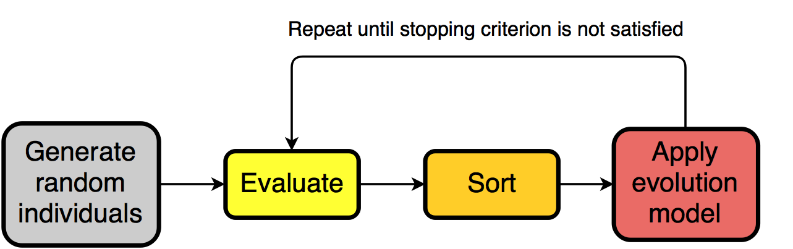

## A brief introduction to genetic algorithms

gago is intended to not be a blackbox. On the contrary, it's codebase is meant to be cristal clear. As such, an introduction to genetic algorithms is necessary in order to understand gago's implementation.

### Summary

A genetic algorithm (GA) is a method for searching solutions to a problem. It belongs to the class of evolutionary algorithms (EA).

Any solution to a problem can be found on a search space defined by the possible inputs to the problem. For example, the problem $min(f(x))$ can contain one or more solutions on the $\mathbb{R}$ search space if $x$ can be any real number. Importantly, if $f(x)$ can be written with mathematical terms then one can access a wide range of mathematic optimization techniques to solve $min(f(x))$. However, if $f(x)$ cannot be written mathematically but can be described with plain words, like so:

> *Given a list of cities and the distances between each pair of cities, what is the shortest possible route that visits each city exactly once and returns to the origin city?*,

then it isn't possible to solve the problem with classical methods because there isn't a clear way of writing this in a closed-form expression enabling the use of such methods.

GAs make abstraction of how the problem is written. Instead, they ***only*** consider the input and the output of the problem. This is very important to understand. This way of thinking enables the potential solving of ***any*** problem. Indeed, a problem always has to have a set of candidate solutions (the input) and an associated response (the output).

GAs use heuristics to explore the search space defined by the inputs in an intelligent manner. In this sense a genetic algorithm is a machine learning technique. Specifically GAs are inspired from natural evolution and intend to mimic the interaction between individuals in a population.

!!! note "Note"
    Mathematical optimization techniques will usually outperform genetic algorithms if a function can be written mathematically. Genetic algorithms lose in power regarding potentially mathematically written functions because they don't suppose anything on the function itself.

### Terminology

The terms surrounding genetic algorithms are roughly analogous to those found in biology.

Fitness function
:   The fitness function is simply the function associated to a given problem. It takes in an input and returns an output.

Individual
:   An individual contains a ***genome*** which represents a candidate solution. In the physical world, an individual's genome is composed of acids. In an imaginary world, it could be composed of floating point numbers or string sequences representing cities. A ***fitness*** can be associated to a genome thanks to the fitness function. For example, one could measure the height of a group of individuals in order to rank them. In this case the genome is the body of the individual, the fitness function is the act of measuring the height of the individual's body and the fitness is the height of individual measured by the fitness function.

Population
:   Individuals are contained in a population wherein they can interact.

Crossover
:   A crossover acts on two or more individuals (called ***parents***) and mixes their genome in order to produce one or more new individuals (called ***offsprings***). Crossover is really what sets genetic algorithms apart from other evolutionary methods. An optimal crossover

Selection
:   Selection is a process in which parents are selected to generate offsprings, most often by applying a crossover method. Popular selection methods include ***elitism selection*** and ***tournament selection***.

Mutation
:   Mutation applies random modifications to an individual's genome without interacting with other individuals.

!!! note "Note"
    Crossover, selection, mutation are more generally called **genetic operators**. A genetic operator is simply a method an individual uses to modify it's genome, either through interaction with other individuals or by itself.

Migration
:   ***Multi-population*** GAs run more than one population in parallel and exchange individuals between each other.

Speciation
:   In the physical world, individuals do not mate at random. Instead, they mate with similar individuals. For some problems such as neural network topology optimization, crossover will often generate poor solutions. Speciation sidesteps this by mating similar individuals (called **species**) separately.

Evolution model
:   An evolution model describes the exact manner and order in which genetic operators are applied to a population. The classic evolution models are the **steady state** model and the **generational model**.

!!! note "Note"
    The fact that there are different ways of applying genetic operators is often omitted in introductions to genetic algorithms. However this is extremely important, for example some people believe that crossover is useless and use mutation for generating new individuals.

### Methodology

In a nutshell, a GA solves an optimization problem by doing the following:

1. Generate random solutions.
2. Evaluate the solutions.
3. Sort the solutions according to their evaluation score.
4. Apply genetic operators following a model.
5. Repeat from step 2 until the stopping criterion is not satisfied.

This description is voluntarily vague as to how the genetic operators are applied. It's important to understand that there isn't a single way of applying genetic algorithms. For example some people believe that crossover is useless and use mutation for generating new individuals. Genetic operators are applied following a *model*, a fact that is often omitted in introductions to genetic algorithms.

!!! note "Note"
    Popular stopping criterions include a fixed number of generations, a fixed duration and an indicator that the population is stagnating.

### Further reading

- [An Introduction to Genetic Algorithms - Melanie Mitchell](http://www.boente.eti.br/fuzzy/ebook-fuzzy-mitchell.pdf)
- [The Multipopulation Genetic Algorithm: Local Selection and Migration - Hartmut Pohlheim](http://www.pohlheim.com/Papers/mpga_gal95/gal2_1.html)

## When to use genetic algorithms?

Genetic algorithms are often a good solution to [NP-hard problems](https://www.wikiwand.com/en/NP-hardness). They usually perform better than [hill climbing](https://www.wikiwand.com/en/Hill_climbing) and [simulated annealing](https://www.wikiwand.com/en/Simulated_annealing) because they explore the search space more intelligently.

As mentionned earlier, some problems can simply not be written down as [closed-form expressions](https://www.wikiwand.com/en/Closed-form_expression). For example tuning the number of layers and of neurons per layer in neural networks is an open problem that doesn't yet have a reliable solution. Neural networks used in production are usually architectured by human experts. The field of [neuroevolution](https://www.wikiwand.com/en/Neuroevolution) aims to train neural networks with evolutionary algorithms. As such genetic algorithms are a good candidate for training neural networks, either by optimizing the network's topology or it's weights and biases.

## How is gago designed?

## Why use gago?
