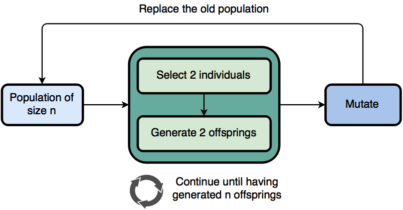

There are numerous variants of the genetic algorithm. gago is genetic enough so as to make it possible to easy use different so called *models*. Simply put, a models tells the story of how a GA enhances a population of individuals through a sequence of genetic operators. It does without considering whatsoever the underlying operators. In a nutshell, an evolution model attemps to mimic evolution in the real world. It's extremely important to choose a good model because it is usually the highest influence on the performance of a GA.

## Generational model

The generational model is one the, if not the most, popular models. Simply put it generates $n$ offsprings from a population of size $n$ and replaces the population with the offsprings. The offsprings are generated by selecting 2 individuals from the population and applying a crossover method to the selected individuals until the $n$ offsprings have been generated. The newly generated offsprings are then optionally mutated before replacing the original population. Crossover generates two new individuals, thus if the population size isn't an even number then the second individual from the last crossover (individual $n+1$) won't be included in the new population.

### Diagram



### Pseudocode

```
offsprings = ()
while size of offspring < size of population:
    parent1, parent2 = select(population, 2)
    offspring1, offspring2 = crossover(parent1, parent2)
    add offspring1 and offspring2 to offsprings

for each individual of offsprings:
    if rand() < mutationRate:
        mutate(individual)

replace population with offsprings
```

### Parameters

| Parameter       | Presence |
|-----------------|----------|
| Selector        | Required |
| Crossover       | Required |
| Mutator         | Optional |
| Mutation rate   | Optional |


## Steady state model

The steady state model differs from the generational model in that the entire population isn't replaced between each generations. Instead of adding the children of the selected parents into the next generation, the 2 best individuals out of the two parents and two children are added back into the population so that the population size remains constant. However, one may also replace the parents with the children regardless of their fitness. This method has the advantage of not having to evaluate the newly generated offsprings. Whatsmore, crossover often generates individuals who are sub-par but who have a lot of potential; giving individuals generated from crossover a chance can be beneficial on the long run.

### Diagram


### Pseudocode

```
parent1, parent2 = select(population, 2)
offspring1, offspring2 = crossover(parents)

if keepBest:
    evaluate(offspring1)
    evaluate(offspring2)
    best1, best2 = selectBest(parent1, parent2, offspring1, offspring2)
    replace parent1 with best1
    replace parent1 with best2
else:
    replace parent1 with offspring1
    replace parent1 with offspring2

for each parent:
    if rand() < mutationRate:
        mutate(parent)
```

### Parameters

| Parameter       | Presence |
|-----------------|----------|
| Selector        | Required |
| Crossover       | Required |
| KeepBest        | Required |
| Mutator         | Optional |
| Mutation rate   | Optional |


## Select down to size

The select down to size method uses two selection rounds. The first one is classic and picks parents to generate new individuals with crossover. However, the offsprings are then added to the original population and a second selection round occurs to determine which individuals will survive to the next generation. Formally $m$ offsprings are generated from a population of $n$, the $n+m$ individuals are then "selected down to size" so that there only remains $n$ individuals. Finally the $n$ newly selected individuals may be mutated.

### Diagram


### Pseudocode

```
offsprings = generateOffsprings(m, individuals, selectorA, crossover)
evaluate(offsprings)
offsprings = merge(offsprings, individuals)
individuals = select(len(individuals), offsprings, selectorB)

for each individual of individuals:
    if rand() < mutationRate:
        mutate(individual)
```

### Parameters

| Parameter       | Presence |
|-----------------|----------|
| NbrOffsprings   | Required |
| SelectorA       | Required |
| Crossover       | Required |
| SelectorB       | Required |
| Mutator         | Optional |
| Mutation rate   | Optional |


## Ring model

In the ring model, each individual crosses over with its neighbor in a one-directional ring topology. One of the individuals out of offsprings or the original individual is selected to replace the original individual. Formally, an individual at position $i$ will crossover with it's neighbour at position $i+1$ and generates 2 offsprings. The last individual is connected to the first individual.

### Diagram

### Pseudocode

```
foreach i, individual in individuals:
    neighbour = individuals[i % len(individuals)]
    offspring1, offspring2 = crossover(individual, neighbour)
    selected = select(individual, offspring1, offspring2)
    individuals[i] = selected

for each individual of individuals:
    if rand() < mutationRate:
        mutate(individual)
```

### Parameters

| Parameter       | Presence |
|-----------------|----------|
| Selector        | Required |
| Crossover       | Required |
| Mutator         | Optional |
| Mutation rate   | Optional |


## Simulated annealing

Although [simulated annealing](https://www.wikiwand.com/en/Simulated_annealing) isn't a genetic algorithm, it can nonetheless be implemented with gago. A mutator is the only necessary operator. Other than that a starting temperature, a stopping temperature and a decrease rate have to be provided. Effectively a single simulated annealing is run for each individual in the population.

!!! note "Note"
    The temperature evolution is relative to one single generation. In order to mimic the original simulated annealing algorithm, one would the number of individuals to 1 and would run the algorithm for only 1 generation. However, nothing stops you from running many simulated annealings and to repeat them over many generations.

### Diagram

### Pseudocode

```
while T > T_min:
    foreach i, individual in individuals:
        neighbour = mutate(individual)
        if neighbour.fitness < individual.fitness:
            individuals[i] = neighbour
        else:
            ap = exp((neighbour.fitness - individual.fitness) / T)
            if rand() < ap:
                individuals[i] = neighbour
    T = T * alpha
```

### Parameters

| Parameter                     | Presence |
|-------------------------------|----------|
| Mutator                       | Required |
| Starting temperature (T)      | Required |
| Stopping temperature (Tmin)   | Required |
| Decrease rate (Alpha)         | Required |


## Mutation only

Although [simulated annealing](https://www.wikiwand.com/en/Simulated_annealing) isn't a genetic algorithm, it can nonetheless be implemented with gago. A mutator is the only necessary operator. Other than that a starting temperature, a stopping temperature and a decrease rate have to be provided. Effectively a single simulated annealing is run for each individual in the population.

### Diagram

### Pseudocode

```
parents = select(nbr_parents, individuals)
offsprings = []
i = 0

foreach parent of parents:
    if keep_parents:
        offsprings[i] = parent
        i++
    for j in 0 to nbr_offsprings:
        offsprings[j] = mutate(parent)
        i++

individuals = offsprings
```

### Parameters

| Parameter                     | Presence |
|-------------------------------|----------|
| NbrParents                    | Required |
| Selector                      | Required |
| KeepParents                   | Required |
| NbrOffsprings                 | Required |
| Mutator                       | Required |
