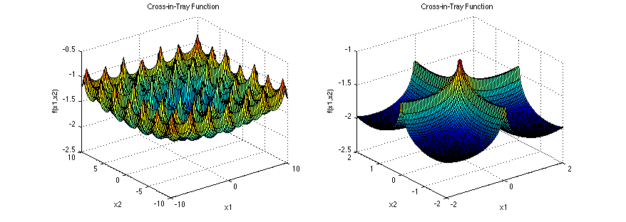
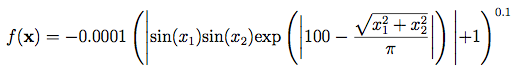

# Cross-in-Tray function optimization

The Cross-in-Tray function is particularly interesting because it reaches a minimum value of -2.06261 in `X = (±1.3491, ±1.3491)`; in other words it is suitable for multi-objective optimization because it has 4 global minimums. This is a good use-case for speciation because each specie can target a different minimal point.

I used [this blog post](https://jakevdp.github.io/blog/2012/08/18/matplotlib-animation-tutorial/) as a reference for using Matplotlib's `animation` tool.

  
  

Run `go run main.go && python plot_progress.py` in a terminal to get the following kind of animation.

    

